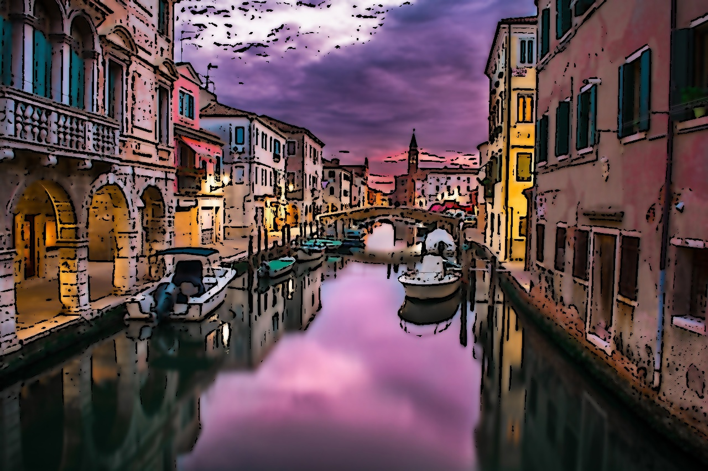
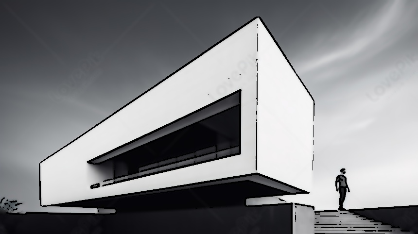
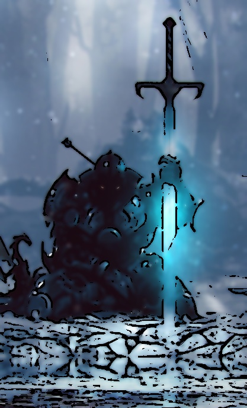
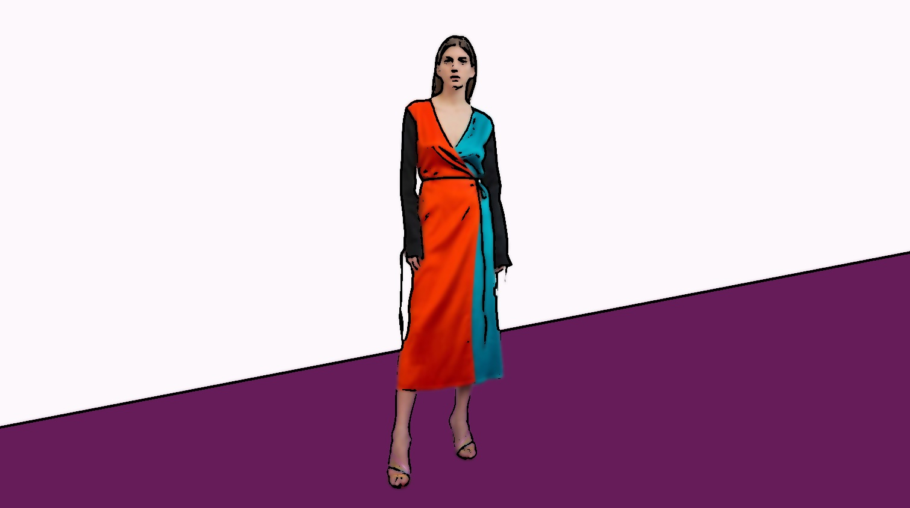
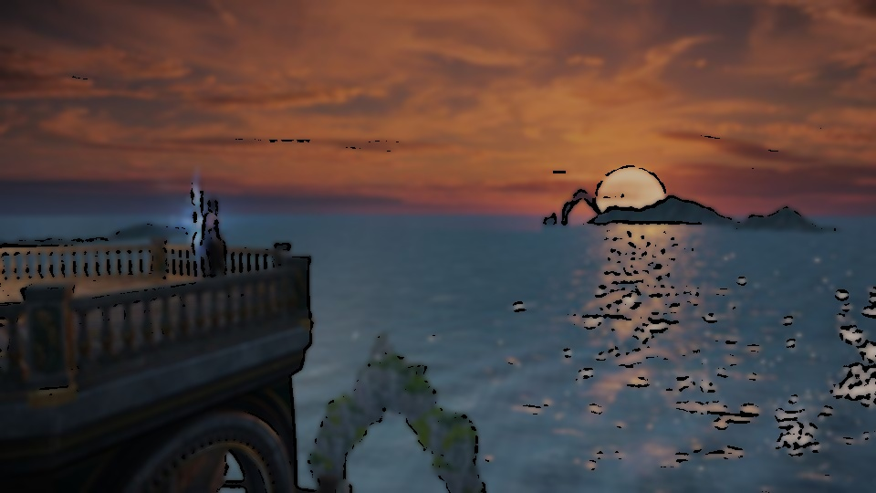
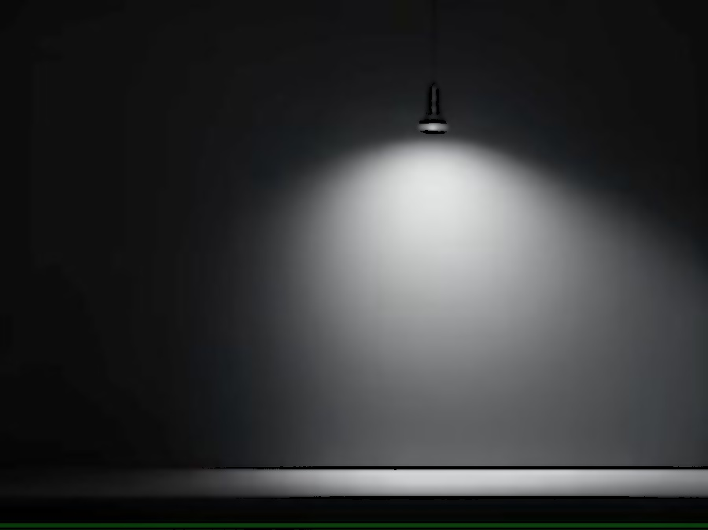

# Cartoon_Rendering

This project uses OpenCV to transform images into a cartoon-like style by applying edge detection and color simplification.

## How it Works

This project converts an image into a cartoon-style effect using OpenCV. The process consists of the following steps:

1. **Load Image:** The input image is loaded and resized while maintaining its aspect ratio.
2. **Convert to Grayscale:** The image is converted to grayscale to simplify edge detection.
3. **Apply Median Blur:** A median blur is applied to reduce noise.
4. **Detect Edges:** Adaptive thresholding is used to create a binary edge mask.
5. **Simplify Colors:** A bilateral filter smooths the image while preserving edges.
6. **Combine Edges and Colors:** The edges are overlaid on the simplified color image to create a cartoon effect.
7. **Save & Display Output:** The processed image is saved and displayed.

## Usage

1. 필요한 라이브러리 설치:
   ```bash
   pip install opencv-python
   ```
2. `cartoon_rendering.py` 실행:
   ```bash
   python cartoon_rendering.py
   ```

### Code Implementation

```python
import cv2
import numpy as np

def cartoonize_image(image_path, out_path):
    # Load Image
    img = cv2.imread(image_path)
    height, width = img.shape[:2]
    img = cv2.resize(img, (width, height))
    
    # Convert to Grayscale
    gray = cv2.cvtColor(img, cv2.COLOR_BGR2GRAY)
    
    # Apply Median Blur
    gray = cv2.medianBlur(gray, 5)
    
    # Detect Edges using Adaptive Thresholding
    edges = cv2.adaptiveThreshold(gray, 255, cv2.ADAPTIVE_THRESH_MEAN_C, 
                                  cv2.THRESH_BINARY, 9, 9)
    
    # Simplify Colors using Bilateral Filter
    color = cv2.bilateralFilter(img, d=9, sigmaColor=200, sigmaSpace=200)
    
    # Combine Edges and Colors
    cartoon = cv2.bitwise_and(color, color, mask=edges)
    
    # Save Output
    cv2.imwrite(out_path, cartoon)

    # Display Output
    file_name = image_path.split('/')[-1]
    cv2.imshow(f"Cartoonized_{file_name}", cartoon)
    cv2.waitKey(0)
    cv2.destroyAllWindows()

# Run the cartoonization process for multiple images
for i in range(0, 14):
    cartoonize_image(f"./data/sample/sample{i}.jpg", f"./data/output/output{i}.jpg")
```

## Sample Results

All images are sourced from data>Image_Source.txt.

There are a total of 28 images, 14 of each sample image and result image, but because there are too many, only two of each are put in. Other sample images and result images are in data>sample and data>output. 

All resulting images were analyzed in data>output>anyzing_output.txt.


### ✅ Good Examples
These images exhibit strong cartoon-like effects due to clear edge detection and color separation.

- **[Venice Scene](./data/sample/sample3.jpg)** (sample3)  
  *Clear separation between colors and well-defined edges.* 

  


- **[Simple White Building Scene](./data/sample/sample11.jpg)** (sample11)  
  *Resembles an actual cartoon image due to its simplicity.*

  


### ⚠️ So-so Examples
These images show partial cartoon effects but lack clear definition in some areas.

- **[Background Screen Shot](./data/sample/sample1.jpg)** (sample1)
  *The algorithm distinguishes between the background and the character but struggles to detect internal contours.*
  
  


- **[Cartoon Character with Strong Colors](./data/sample/sample8.jpg)** (sample8)  
  *Strong color contrast but does not distinguish boundaries well.* 

  


### ❌ Bad Examples
These images fail to produce a strong cartoon effect due to weak edge detection or color blending.

- **[Game(LostArk) Screen Shot](./data/sample/sample0.jpg)** (sample0)
  *The background is too complex, making edge detection difficult.*

  


- **[High-Contrast Lighting Scene](./data/sample/sample12.jpg)** (sample12)  
  *Finds floor and lamp edges but fails to capture light transitions.*  

  


## Algorithm Limitations
While this approach is effective in many cases, there are limitations:

1. **Struggles with Similar Colors**: If foreground and background have similar shades, edges may not be well detected.
2. **Fails with Soft Shadows**: Shadows and lighting gradients may not be distinguished effectively.
3. **Complex Textures Can Confuse Detection**: Textured backgrounds or highly detailed images may result in noisy outputs.
4. **Requires Good Contrast**: Works best when there is strong contrast between different elements in the image.


---
**Conclusion**: This OpenCV-based cartoonization works best on images with clear contrast, strong edges, and simple backgrounds. Fine textures and subtle color changes may not be well preserved in the final output.